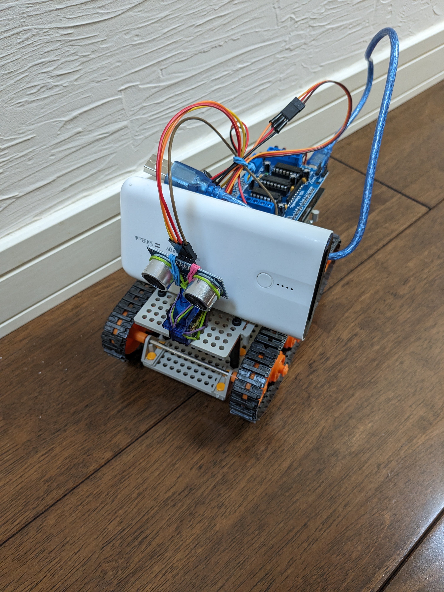
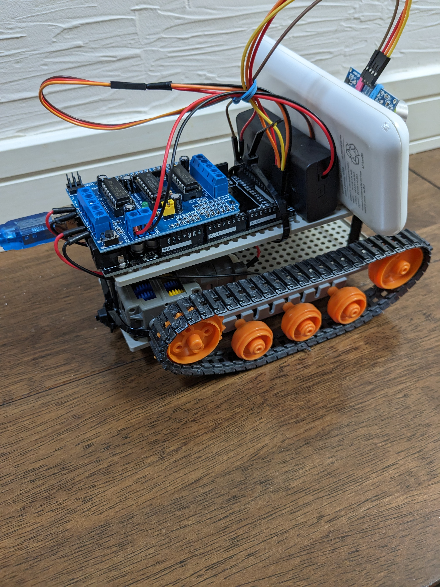
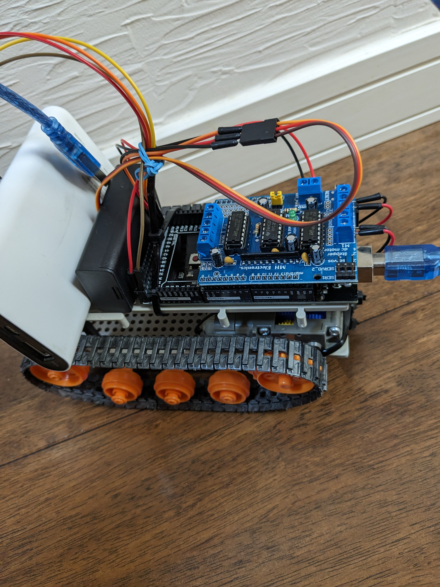
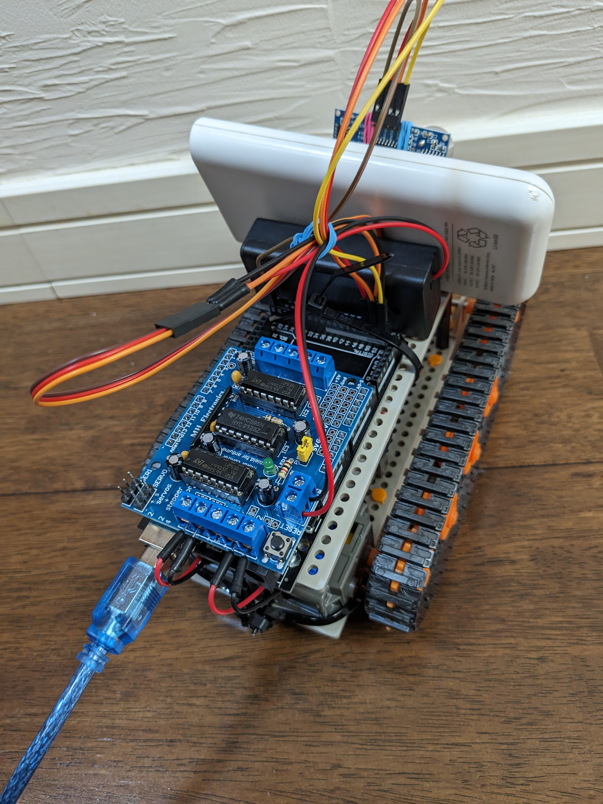
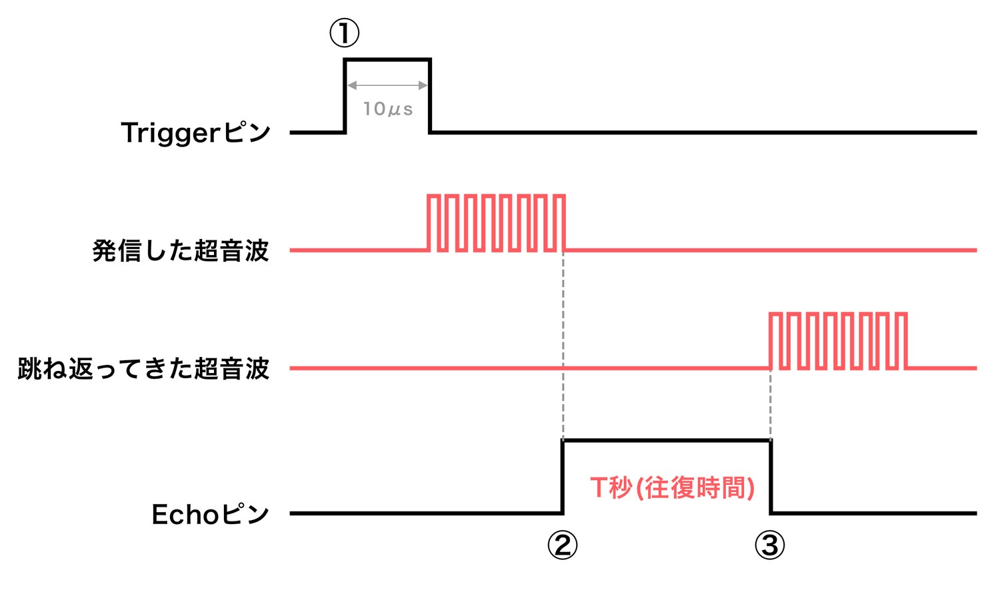

# Arduinoで自動運転
Arduinoを使用し自動運転のロボットカーを作成しました 

## 完成形
ロボットカー

 

 

## 材料
使用したもの 
※今回は作成期間が限られていたので、手に入りやすい材料で作成しました  
もっと良い材料があるかもしれません  

### Arduino mega
Arduino UnoだとモータードライバがGpioピンを全て使用してしまうので、Arduino megaを使用 
[Arduino Mega](https://amzn.asia/d/7uSjvky)  

### モータードライバ
Arduinoの機能拡張シールド  
Arduinoボードに接続するだけで機能を追加することができる  
[KKHMF L293d](https://amzn.asia/d/cqGxtsh)  

### モーター
今回は、ダブルギアボックスが手に入らなかったので、シングルギアボックスを2個繋げて使用しました 
※2個繋げての使用だと、プレートに入らないのでギアボックスの角を削る必要がありました 
ダブルギアボックスを使用した方が楽に組み立てが可能で見栄えもよくなると思います 
[シングルギアボックス](https://amzn.asia/d/fMhvGMw)  
[ダブルギアボックス](https://amzn.asia/d/jbmKmqR)  

### プレート 
車体の土台となるプレート  
2枚入っているので、上下に組み立てて使用する  
[ユニバーサルプレート](https://amzn.asia/d/gD9fNzH)  

### 車輪 
タイヤとホイールがセットとなっており、車体の大きさに合わせて車輪を作ることができる  
[トラック&ホイールセット](https://amzn.asia/d/3UqQYvc)  

### 電池 
モータードライバへの電力供給用  
[電池ボックス](https://amzn.asia/d/dlBoPju)  

### サーボモーター 
超音波センサーと連結させて、超音波センサーが首を振れるようにするために使用する  
[サーボモーター](https://amzn.asia/d/c1w4U9Z)  

### 超音波センサー 
障害物との距離を測るために使用  
Arduinoの入門セットにも入ってる  
[超音波センサー](https://amzn.asia/d/cwVZWaR)  

### モバイルバッテリー 
モバイルバッテリーを使用することで、パソコンと連結させる必要がなくなる  
独立して動けるようになる  

### その他 
組み立てに必要な道具類 
- プラスドライバー 
- ハサミ 
 

部品連結に使用したもの 
- 輪ゴム 
- 結束バンド 
 
※部品同士を連結させるための部品が手に入らなかったので、輪ゴムや結束バンドで代用しました 

### 

## プログラム

### 使用したライブラリ
インストール方法
- スケッチ
    - ライブラリをインクルード
        - ライブラリを管理
 
インストールしたライブラリ 
モータードライバのライブラリ
- Adafruit Moter Sheild library 

### 障害物を検知する仕組み
超音波センサーを使用し障害物との距離を測ることで、車体をコントロールする

距離の測り方 

距離 = 音速 * 往復時間 / 2 
 

音速の定義 
音速 = 331.5 + 0.61 * t
 
tは摂氏温度 
 

距離の計算方法 
距離 = 331.5 + 0.61 * 20 * 往復時間 / 2 
 

往復時間 
pulselnを使用することで、出力した超音波が帰ってくる時間を取得することができる 

